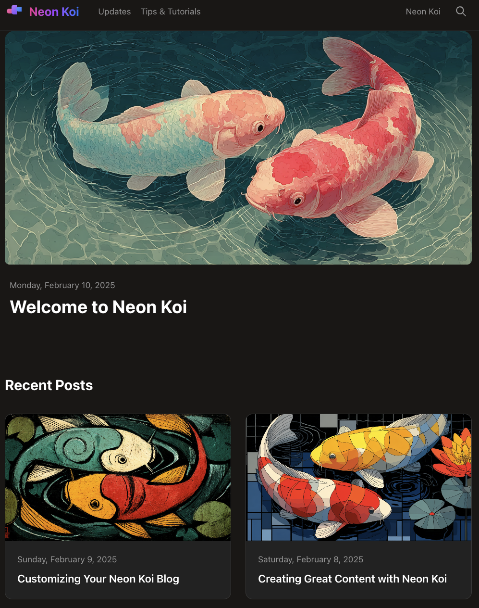

# Neon Koi

A blog template built with Astro and Tailwind CSS. Features a clean, modern design with light/dark theme support, content collections for type-safe blog posts, and a configurable site setup.

**Live Demo:** https://gnokit.github.io/neon-koi-blog-template



## Features

- Static site generation with Astro
- Light/dark theme toggle
- Content collections for type-safe blog posts
- Centralized TypeScript configuration
- MDX support for rich content
- RSS feed generation
- SEO-friendly with sitemap

## Getting Started

```bash
# Install dependencies
npm install

# Start development server
npm run dev

# Build for production
npm run build

# Preview production build
npm run preview

# Convert PNG images to WebP for faster loading
npm run to-webp

# Build for GitHub Pages (with base URL)
npm run build:github

# Preview GitHub Pages build locally
npm run preview:github

# Deploy to GitHub Pages (builds and pushes to gh-pages branch)
npm run deploy
```

## Project Structure

```
src/
├── components/      # Reusable UI components
├── config/          # Site configuration
├── content/         # Content collections
│   └── blog/        # Blog posts (Markdown/MDX)
├── layouts/         # Page layouts
├── pages/           # Routes
├── styles/          # Global styles
└── utils/           # Helper functions
```

## Deployment

This template is configured for manual deployment to GitHub Pages using the `gh-pages` branch approach.

### Setup

1. Update your repository Settings > Pages:
   - Change **Source** to "Deploy from a branch"
   - Select **Branch**: `gh-pages` and **Folder**: `/ (root)`

2. Install the `gh-pages` package (already included):
   ```bash
   npm install --save-dev gh-pages
   ```

### Deploy

```bash
# Build and deploy to GitHub Pages
npm run deploy
```

This builds the site with the correct base URL (`/neon-koi-blog-template/`) and pushes the `dist/` folder to the `gh-pages` branch.

### Development Commands

| Command | Purpose |
|---------|---------|
| `npm run dev` | Local development at `localhost:4321` |
| `npm run build` | Build for local preview (no base URL) |
| `npm run build:github` | Build for GitHub Pages subdirectory |
| `npm run preview:github` | Preview GitHub Pages build locally |
| `npm run deploy` | Build and deploy to GitHub Pages |

## Content

Blog posts are written in Markdown or MDX and stored in `src/content/blog/`. Each post includes frontmatter with title, description, publication date, author, and optional metadata.

## License

MIT
